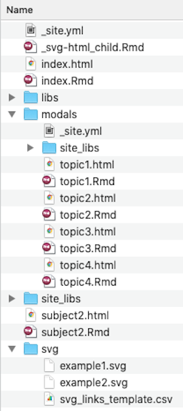
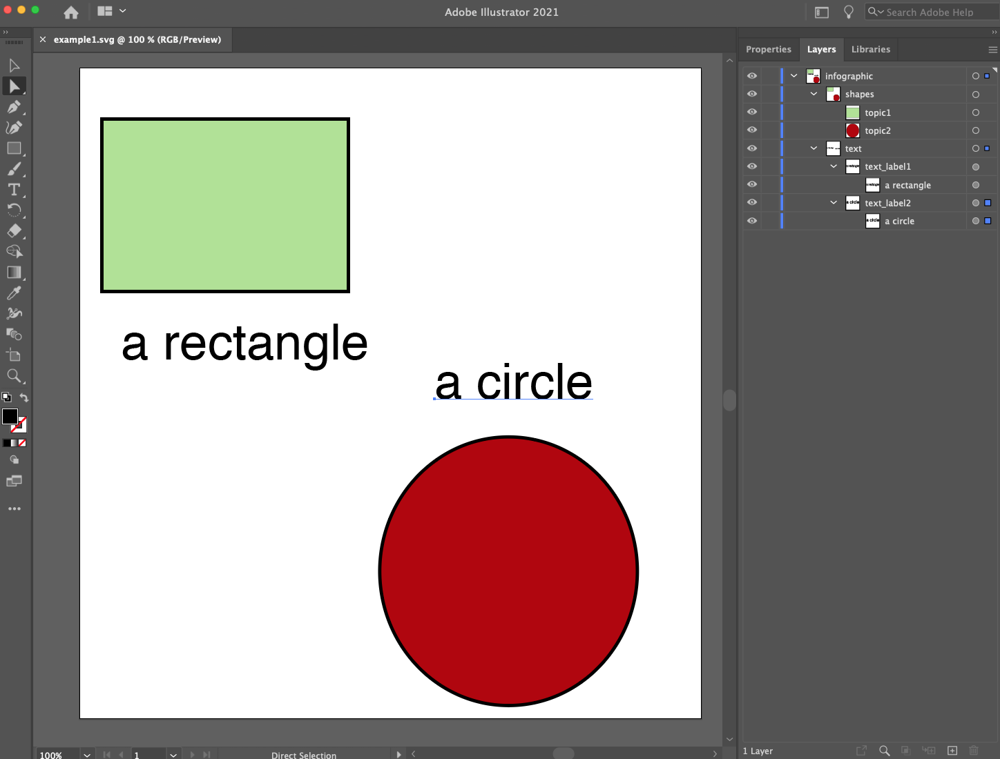
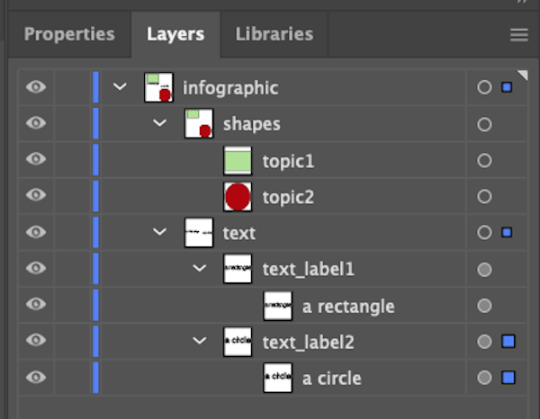
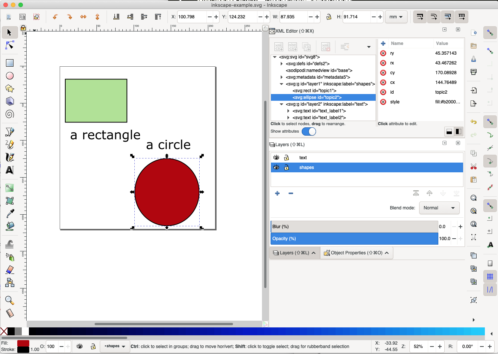
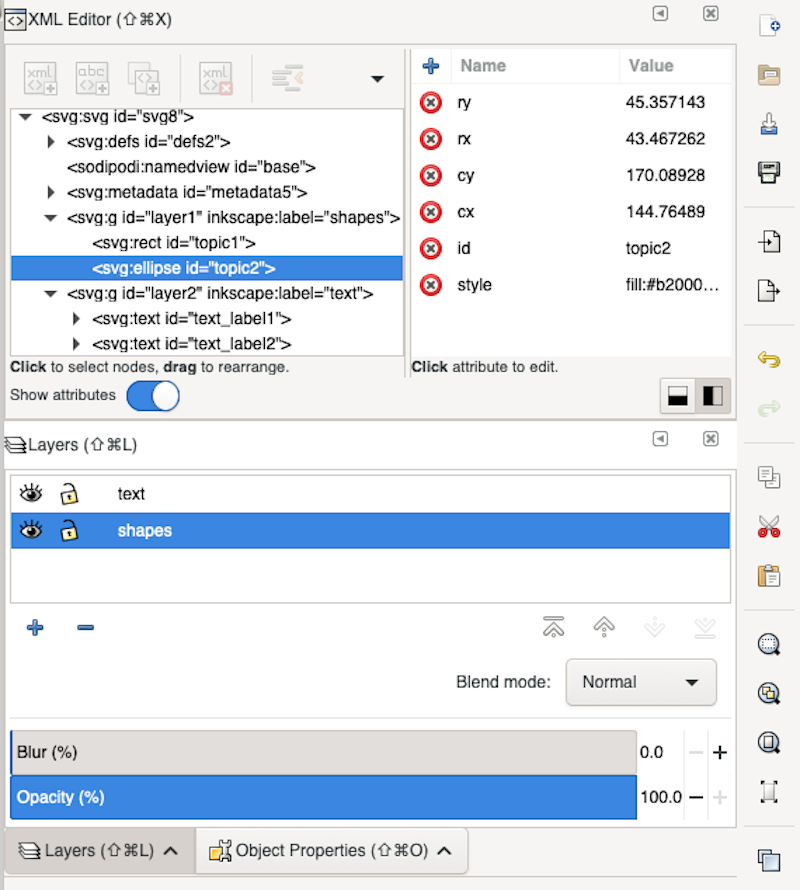
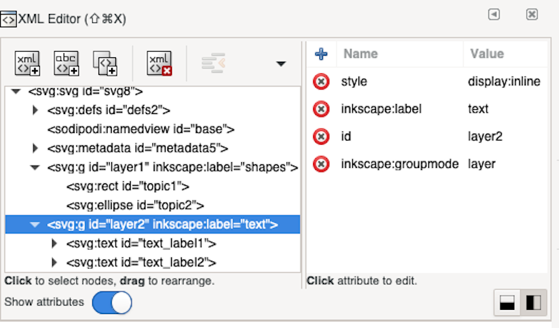

```{r setup, include=FALSE}
knitr::opts_chunk$set(echo = TRUE)
```
# Getting started

The most straightforward way to get started is to modify the template version of a infographic-based site contained within the nms4r package. To install the website template in a local folder, use the nms4r function `create_website()`. Please note that the template website won't display properly unless it is being served locally. One method of doing so is through the Viewer Pane of R Studio, via the use of the following command (replacing "template_website" with the relative path to your local location of the site): `servr::httd(here::here("template_website"))`

The file structure of the template site can be seen below.



There are several key elements of the site.

1. The top-level directory. R Markdown files in the top directory should primarily exist to display clickable infographics, with data and figures primarily being provided in the "modals" directory (see below). By default, the html-rendered version of index.Rmd in the top-level directory is what the site will initially display. 

   If a clickable infographic is to be shown on a page, the associated R Markdown file will need to contain certain YAML front matter. In the example of index.Rmd (which does contain a clickable infographic), the YAML front matter looks as follows:

```
---
title: "Subject 1"
params:
  csv: "svg/svg_links_template.csv"
  svg: "svg/example1.svg"
---
```

   The two "params" values point respectively to 1) a csv file that provides a list of links and 2) a svg file that is the clickable image (more on both of these further down in these instructions).

   
2. _site.yml. One of the primary roles of this YAML file in the top-level directory is to provide the site navigation via the "navbar". See below, for the default settings for the navbar in _site.yml:

```
navbar:
  title: "Template"
  icon: fa-info
  left:
    - text: "Subject 1"
      href: index.html
    - text: "Subject 2"
      href: subject2.html
  right:
    - text: "About"
      href: https://marinebon.org/sanctuaries/
```

3. The svg folder. The svg folder contains the clickable infographics (see section below on the creation of these images) as well as a csv file that maps the elements of each infographic to a link. Here is that csv file for the the template website ("svg_links_template.csv"):

```{r csv, echo=FALSE}
info<-read.csv(here::here("inst/template_website/svg/svg_links_template.csv"), header = T)
info
```

* svg: file name of image
* id: clickable element of image
* title: text to be displayed over clickable element upon mouseover
* link: link to modal window

4. The modals folder. The modals folder contains the R Markdown files that primarily exist to display the data and figures for the website.

# Creating infographic images
Here, we discuss the process of creating images in a format that can be used by nms4r. It is recommended that vector-based graphics software be used to create your images and we provide instructions for two such software packages:

* [Adobe Illustrator](https://www.adobe.com/products/illustrator.html) (commercial software that requires a paid license)

* [Inkscape](https://inkscape.org/) (open source software that can be used at no cost)

## Creating images in Adobe Illustrator

A basic knowledge of Illustrator is assumed (if you need to get up to speed, Adobe has some [great tutorials](https://helpx.adobe.com/illustrator/tutorials.html)).

Below, you can see an example infographic created within Illustrator (you can find this example image illustrator-example.svg within the svg folder of the template website). There are two key components to a nms4r infographic, when it is served up on a website. First, key elements of the infographic are clickable. Secondly, within-image captions exist for the infographic that can be toggled on and off. 



To show how images need to be formatted in order to behave as expected, let's zoom in on the Layer panel in the upper right of the above image. To view the Layer panel from the Menu, select Window > Layers.



1. Every clickable element of an infographic needs to have a separate name. In this example, the rectangle and circle are both intended to be clickable and they, respectively, have been given the names "topic1" and "topic2".

2. Every clickable element must have no other elements layered above it (below is fine).

3. All within-image captions must be contained within a layer called "text".

4. Lastly, the image must be saved in svg format.

## Creating images in Inkscape

A basic knowledge of Inkscape is assumed (if you need to get up to speed, [here are some great tutorials](https://inkscape.org/learn/tutorials/)).

Below, you can see an example infographic created within Inkscape (you can find this example image inkscape-example.svg in the svg folder within the template website). There are two key components to a nms4r infographic, when it is served up on a website. First, key elements of the infographic are clickable. Secondly, within-image captions exist for the infographic that can be toggled on and off. 



To show how images need to be formatted in order to behave as expected, let's zoom in on the panels to the right. You'll need to have three panels visible:

1. Layers (to show from Menu, Layer > Layers...)

2. Object Properties (to show from Menu, Object > Object Properties...)

3. XML Editor (to show from Menu, Edit > XML Editor...)



1. Every clickable element of an infographic needs to have a separate id, which can be edited in the
Object Properties panel. In this example, the rectangle and circle are both intended to be clickable and they, respectively, have been given the id's "topic1" and "topic2".

2. Every clickable element must have no other elements layered above it (below is fine).

3. All within-image captions must be contained within a layer called "text". To move a text element into the "text" layer, right-click on that element and select the "Move to Layer..." option.

4. Two edits need to be made for the "text" layer (see image below). In the XML Editor, click the entry which contains 'inkscape:label="text"'. Edit 1: in the box to the right, change the id to "text". Edit 2: in the box to the right, click the x in the red circle by "style display:inline" (thereby deleting that row).



4. Lastly, the image must be saved in svg format.
